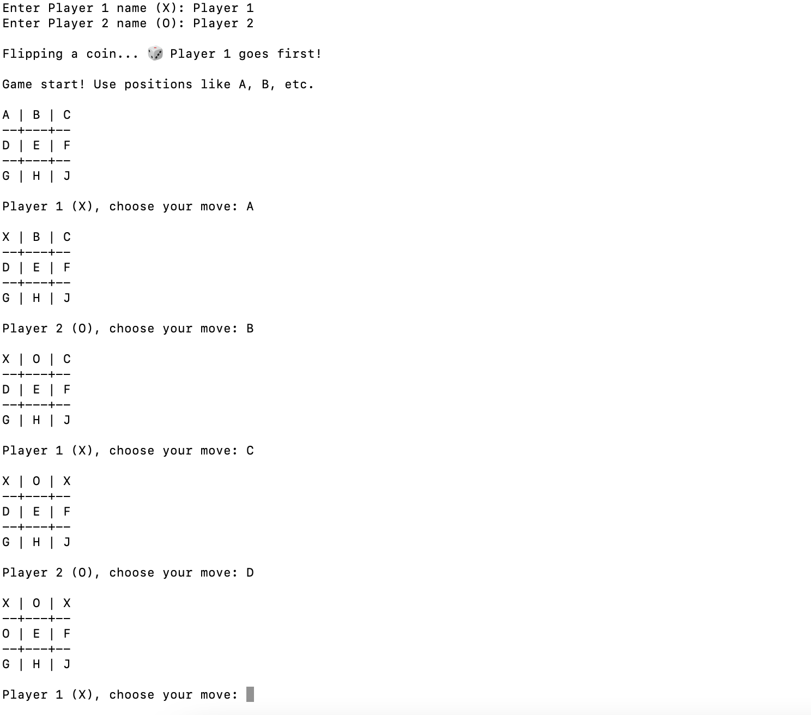

# 🎮 Tic Tac Toe (Python CLI Version)

A two-player command-line Tic Tac Toe game built in Python, featuring a custom letter-based board layout, player name input, randomized turns, win/draw detection, and replay fuctionality.

---

## 🤔 Why I Built This

I wanted a fun way to sharpen my Python skills, particularly object-oriented programming and user input handling. This classic game was the perfect excuse to play with classes, dictionaries, and ASCII art.

Plus, I gave it a twist: the board spaces use single-letter labels (`A`-`J`, skipping `I`) instead of traditional coordinates. Because why not?

---

## 🧠 Features

- 🎲 Randomized player order (coin flip)
- 🔤 Custom board labels: `A` through `J` (skipping `I`)
- 👤 Player name input
- 🧠 Win/draw detection
- ♻️ Replay functionality
- 📦 Fully modular OOP design using a `TicTacToeGame` class

---

## 📸 Preview

```
A | B | C
--+---+--
D | E | F
--+---+--
G | H | J
```

Players type the letter corresponding to the space where they want to move (e.g., `E`). The game tracks turns, checks for wins/draws, and asks if you'd like to play again.



---

## 🚀 How to Run It

Make sure you have Python 3 installed, then:

```bash
git clone https://github.com/briannemg/python-game.git
cd python-game
python3 tic-tac-toe.py
```

---

## 🧾 Files Included

- `tic-tac-toe.py` - The main game logic
- `README.md` - You're looking at it

---

## 🔮 Future Ideas

- 🤖 Add a simple AI opponent
- 🧮 Score tracking over multiple rounds
- 🎨 GUI version with `tkinter` or `pygame`
- 🌐 Host it as a web app

---

## 📄 License

This project is open-source and created for learning & fun. Fork it, remix it, and enjoy.

---

Made with ☕, Python, and chaotic energy.
